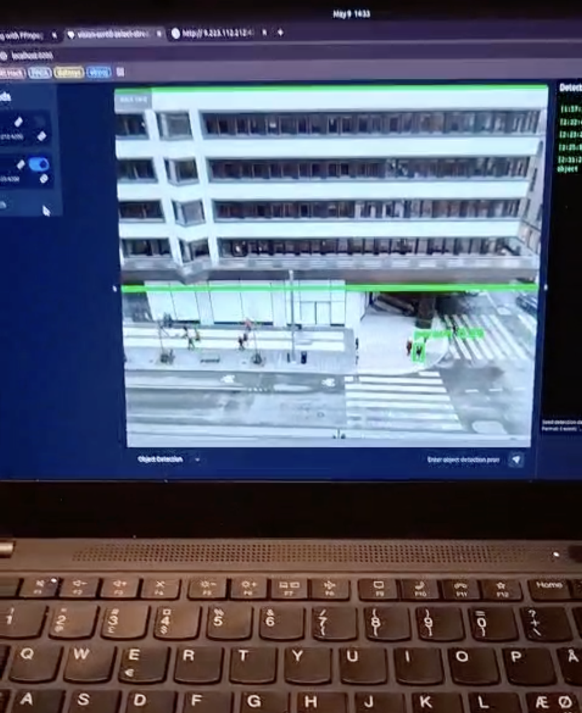

# Achki – Multimodal AI Monitoring Platform  

### Built during the SSE Business Lab × Microsoft Azure × KTH AI Society Hackathon (2025)


Achki is a prototype built during a two-week hackathon.  

It combines **computer vision**, **audio classification**, and **natural-language prompts** to detect events from live camera and microphone streams and display them on a web dashboard.


---


## Prototype Screenshot





**Object detection running on a live camera feed.**


---


## What the Prototype Does


- Streams video from a camera to a backend  

- Runs object detection on frames  

- Performs basic audio classification  

- Accepts natural-language prompts  

- Displays detection events in a simple dashboard  


This is a **hackathon prototype**, so not all components are fully / smoothly integrated.


---


## Technology Stack


### Backend

- **FastAPI** - REST API framework for handling HTTP requests and video streaming
- **YOLOv8 (Ultralytics)** - Real-time object detection model
- **PyTorch** - Deep learning framework for audio classification
- **OpenCV** - Computer vision library for video processing
- **OpenAI GPT-3.5 Turbo** - Natural language processing for prompt interpretation
- **WebSockets** - Real-time bidirectional communication for detection notifications
- **Uvicorn** - ASGI server for running FastAPI applications

### Frontend

- **React** - UI framework
- **TypeScript** - Type-safe JavaScript
- **Vite** - Build tool and development server
- **Tailwind CSS** - Utility-first CSS framework
- **shadcn/ui** - Component library built on Radix UI
- **React Router** - Client-side routing
- **TanStack Query** - Data fetching and caching
- **WebSocket API** - Real-time communication with backend

### Audio Processing

- **YAMNet** - Pre-trained audio classification model from TensorFlow Hub (521 audio event classes)
- **OpenAI GPT-3.5 Turbo** - Generates YAMNet category names based on natural language prompts
- **Custom AudioCNN** - PyTorch-based convolutional neural network for audio classification (alternative to YAMNet, in `sound_detector.py`)
- **librosa** - Audio analysis and feature extraction
- **soundfile** - Audio file I/O
- **torchaudio** - PyTorch audio utilities
- **TensorFlow Hub** - For loading YAMNet model

---


## Architecture Overview


The system consists of three main components:

1. **Backend API Server** (`backend/main.py`) - Handles video streaming, YOLO object detection, audio detection, and prompt processing. Includes:
   - YOLO video detection endpoints
   - Audio detection with YAMNet (when enabled)
   - OpenAI prompt processing endpoint (`/recieve`) for generating YAMNet categories
2. **YAMNet Audio Detector** (`backend/yamnet_detector.py`) - Uses TensorFlow Hub YAMNet model for audio classification, filtering results based on categories from `yamnet_categories.json`
4. **WebSocket Server** (`Frontend/websocket_server.py`) - Broadcasts detection events to connected frontend clients in real-time
5. **Frontend Dashboard** (`Frontend/`) - React-based web interface for viewing video feeds, configuring detection modes, and receiving alerts
6. **Camera Host Services** (`backend/camerahost_rasp.py`, `backend/hostcamer_laptop.py`) - Flask-based services for streaming video from cameras

### Data Flow

**Video Pipeline:**
- Camera feeds stream video frames to the backend
- YOLO model processes frames and detects objects with bounding boxes
- Detection results are stored and served via `/latest-detections` endpoint
- Video feed with annotations is streamed via `/video_feed` endpoint (MJPEG)

**Audio Pipeline (Fully Integrated):**
- Natural language prompts are sent to `/recieve` endpoint in `main.py`
- OpenAI GPT-3.5 analyzes prompt and generates relevant YAMNet category names
- Categories saved to `yamnet_categories.json`
- Audio detector automatically reloads categories (no restart needed)
- `main.py` continuously monitors microphone input (when enabled via `/audio-detection/enable`)
- YAMNet model classifies audio and filters by categories from `yamnet_categories.json`
- When sounds are detected above threshold, events are sent to WebSocket server
- Detection events are broadcast via WebSocket to all connected frontend clients
- Frontend displays video streams, detection results, audio alerts, and terminal logs

---


## Setup Instructions


### Prerequisites

- Python 3.9+
- Node.js 18+ (or Bun)
- uv package manager (for Python virtual environment)
- Camera access (for video streaming)
- OpenAI API key (for prompt processing)

### Backend Setup

1. Navigate to the `backend` directory:
   ```bash
   cd backend
   ```

2. Create a virtual environment using uv:
   ```bash
   uv venv
   source venv/bin/activate  # On Windows: venv\Scripts\activate
   ```

3. Install Python dependencies:
   ```bash
   pip install -r requirements.txt
   ```

4. Create a `.env` file in the `backend` directory with your OpenAI API credentials:
   ```
   OPENAI_API_KEY=your_api_key_here
   OPENAI_DEPLOYMENT_NAME=your_deployment_name
   ```

5. Start the main backend server:
   ```bash
   python main.py
   ```
   The server will run on `http://localhost:8000` and includes:
   - YOLO video detection
   - Audio detection (YAMNet)
   - Prompt processing endpoint (`/recieve`)

6. In a separate terminal, start the WebSocket server:
   ```bash
   cd Frontend
   # Make sure you're using the same Python environment with dependencies installed
   python websocket_server.py
   ```
   The WebSocket server will run on:
   - HTTP API: `http://localhost:8001` (for receiving detection events)
   - WebSocket: `ws://localhost:1234` (for frontend connections)

### Frontend Setup

1. Navigate to the `Frontend` directory:
   ```bash
   cd Frontend
   ```

2. Install dependencies:
   ```bash
   npm install
   # or
   bun install
   ```

3. Start the development server:
   ```bash
   npm run dev
   # or
   bun run dev
   ```
   The frontend will be available at `http://localhost:8080`

### Camera Host Setup

For streaming from a remote camera (Raspberry Pi or laptop), use:
- `backend/camerahost_rasp.py` - Flask server for Raspberry Pi camera streaming (requires `picamera2` library)
- `backend/hostcamer_laptop.py` - Flask server for laptop camera streaming

Note: These camera hosts use Flask (not FastAPI) and run on separate ports. The Raspberry Pi host runs on port 5000, and the laptop host runs on port 5173.

---


## API Endpoints


### Backend API (`main.py`)

- `GET /health` - Health check endpoint
- `POST /detect` - Process a single image and return YOLO detection results
  - Request body: `{"image_data": "base64_encoded_image"}`
- `GET /latest-detections` - Get the latest object detection results
- `GET /video_feed` - Stream video feed with YOLO annotations (MJPEG)
- `GET /latest-audio-detections` - Get the latest audio detection results
- `POST /audio-detection/enable` - Enable continuous audio detection
- `POST /audio-detection/disable` - Disable audio detection
- `GET /audio-detection/status` - Check if audio detection is enabled

### Audio Processing API (integrated in `main.py`)

- `POST /recieve` - Process natural language prompt and generate YAMNet category names
  - Request body: `{"feed_id": "string", "detection_mode": "string", "prompt": "string"}`
  - Returns: Updated YAMNet category names based on prompt analysis (saved to `yamnet_categories.json`)
  - Categories are automatically reloaded by the audio detector when the file is updated

### WebSocket Server (`websocket_server.py`)

- `POST /detection_output` - Receive detection events and broadcast to WebSocket clients
  - Request body: JSON object with `event`, `timestamp`, `feedId`, `probability`, `type`
  - Runs on port 8001 (HTTP API) and port 1234 (WebSocket)
- `WebSocket ws://localhost:1234` - Real-time connection for receiving detection notifications
- Note: Run `python Frontend/websocket_server.py` separately from main backend

---


## Project Structure


```
MS_Hackathon_25/
├── backend/
│   ├── main.py                 # Main FastAPI server with YOLO detection
│   ├── sound_AI.py             # OpenAI integration for prompt processing
│   ├── sound_detector.py       # Audio classification (supports YAMNet and AudioCNN)
│   ├── yamnet_detector.py      # YAMNet model integration
│   ├── infer.py                # YOLO detector class
│   ├── predictor.py            # Additional prediction utilities
│   ├── camerahost_rasp.py      # Raspberry Pi camera streaming
│   ├── hostcamer_laptop.py     # Laptop camera streaming
│   ├── websocket_server.py     # WebSocket server for real-time events
│   ├── requirements.txt       # Python dependencies
│   ├── sound_classes.json      # Audio classification categories (for AudioCNN)
│   └── yamnet_categories.json  # YAMNet categories (updated via prompts)
│
├── Frontend/
│   ├── src/
│   │   ├── pages/
│   │   │   └── Index.tsx       # Main dashboard page
│   │   ├── components/
│   │   │   ├── VideoFeed.tsx   # Video stream component
│   │   │   ├── Terminal.tsx    # Terminal/log display
│   │   │   └── Sidebar.tsx     # Feed management sidebar
│   │   └── App.tsx             # React app entry point
│   ├── package.json            # Frontend dependencies
│   └── websocket_server.py     # WebSocket server
│
└── README.md                   # This file
```

---


## Features


### Video Processing

- Real-time object detection using YOLOv8
- Multiple camera feed support
- Bounding box visualization with confidence scores
- MJPEG video streaming with annotations
- Frame-by-frame detection processing

### Audio Classification

- **YAMNet-based audio classification** - Uses TensorFlow Hub YAMNet model (521 audio event classes)
- Natural language prompt interpretation via OpenAI to generate relevant YAMNet category filters
- Dynamic YAMNet category filtering based on user prompts (categories saved to `yamnet_categories.json`)
- Custom AudioCNN model available as alternative (use `use_yamnet=False` in `SoundDetector`)
- Configurable detection thresholds
- Support for audio files, URLs, and streaming audio
- YAMNet integration available via `SoundDetector(use_yamnet=True)` in `sound_detector.py`

### User Interface

- Multi-feed dashboard with resizable panels
- Real-time detection alerts and notifications
- Terminal-style log viewer
- Detection mode configuration (none, object, audio, custom)
- Natural language prompt input
- Feed management (add, remove, rename, configure)

### Real-time Communication

- WebSocket-based event broadcasting
- Detection event notifications
- Connection status monitoring
- Terminal message logging

---


## Configuration


### Detection Modes

The system supports multiple detection modes (as defined in `VideoFeed.tsx`):

- **none** - No active detection
- **object** - YOLO object detection on video frames
- **motion** - Motion detection (requires prompt)
- **object-motion** - Object-specific motion detection (requires prompt)
- **entrance** - Entrance detection (sub-mode of "No-go Zones", requires prompt)
- **floor** - Floor detection (sub-mode of "No-go Zones", requires prompt)

### Sound Classes

Audio detection categories are defined in `backend/sound_classes.json` and include:
- Speech, Music, Noise, Animal sounds
- Vehicle sounds, Human sounds, Domestic sounds
- Alarm, Bell, Chime

Each category has configurable detection thresholds.

### YAMNet Categories

YAMNet category names are dynamically generated based on natural language prompts via the `/recieve` endpoint. OpenAI analyzes the prompt and returns a list of relevant YAMNet category names, which are saved to `backend/yamnet_categories.json`. The YAMNet detector (`yamnet_detector.py`) uses these categories to filter detection results, focusing only on sounds relevant to the user's prompt. The YAMNet model is loaded from TensorFlow Hub and provides classification across 521 audio event classes.

---


## Development Notes


- The prototype uses YOLOv8n (nano) model by default for faster inference
- Camera feed URL in `main.py` is currently hardcoded to `http://130.229.141.234:5173/video_feed`
- WebSocket server port (1234) must match the frontend configuration in `Index.tsx`
- OpenAI API calls are made for every prompt submission to generate relevant sound category names
- Video processing runs at approximately 20 FPS with a 0.05s sleep between frames
- The frontend prompt submission endpoint (`VideoFeed.tsx`) sends prompts to `/recieve` endpoint in `main.py` and automatically enables audio detection
- The `sound_detector.py` module supports both YAMNet (via `use_yamnet=True`) and custom AudioCNN models
- **YAMNet is fully integrated into `main.py`** - audio detection runs continuously when enabled
- Audio detection automatically reloads `yamnet_categories.json` when updated (no restart needed)
- Detection events are automatically sent to WebSocket server for frontend notifications
- The AudioCNN model is available as an alternative when `use_yamnet=False`
- Camera host services use Flask and run on separate ports from the main FastAPI backend
- The system is designed for local development and may require configuration changes for production deployment

---


## Limitations


As a hackathon prototype, the system has several limitations:

- Not all components are fully integrated
- Error handling is minimal in some areas
- Camera URLs are hardcoded in some places
- No authentication or authorization implemented
- Limited scalability for multiple concurrent streams
- Audio classification model may require training data for custom categories
- WebSocket connections are not persistent across server restarts

---

