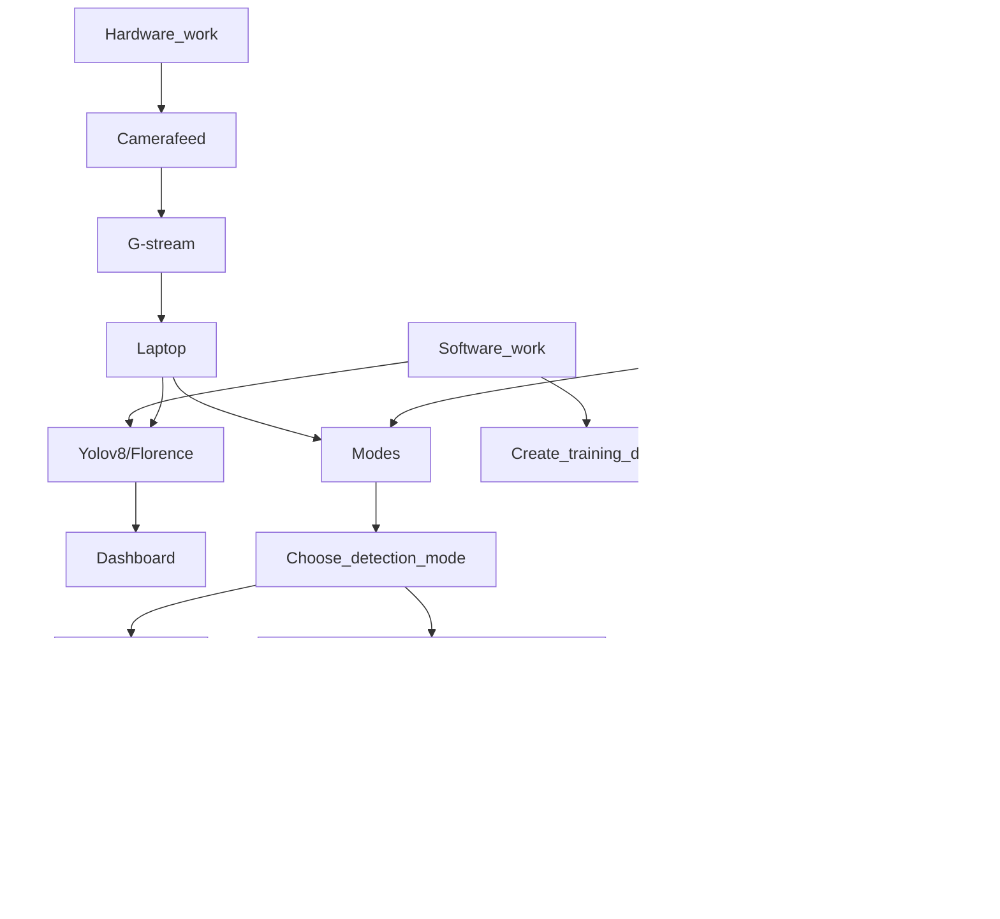

```mermaid
graph TD
    Hardware_work --> Camerafeed --> G-stream --> Laptop
    Laptop --> Modes
    Software_work --> Yolov8/Florence
    Software_work --> Create_training_data
    Laptop --> Yolov8/Florence --> Dashboard

    UI_work --> Modes
    UI_work --> Button_Connect_camera
    Modes --> Choose_detection_mode --> No-go-zones

    Choose_detection_mode --> Option_button_for_object_differentiation
    Option_button_for_object_differentiation --> Objectdetection
    Option_button_for_object_differentiation --> Forkliftdetection
    Option_button_for_object_differentiation --> Humandetection --> Equipmentdetection
    Option_button_for_object_differentiation --> Weapons

```
